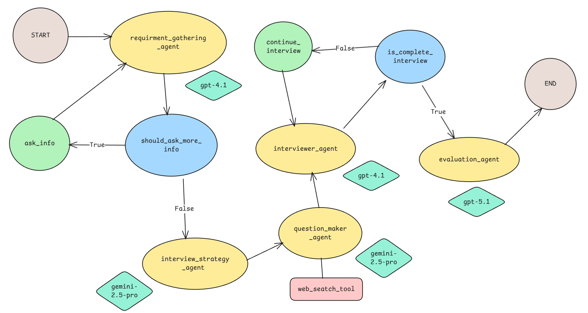
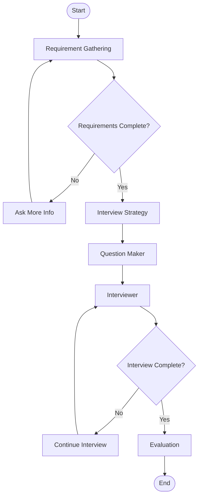

# InterviewIQ 🎯

<div align="center">

**An AI-powered coaching platform designed to help candidates prepare for job interviews through interactive practice and personalized feedback.**

</div>

## 🌟 Overview

**InterviewIQ** is a sophisticated AI interview coaching system that leverages advanced agentic workflows to provide realistic, adaptive interview practice sessions. Built with LangGraph's state machine architecture, the platform guides candidates through a complete interview lifecycle—from requirement gathering to personalized evaluation.

The system employs multiple specialized AI agents working in concert to create a human-like interview experience, complete with dynamic question generation, real-time feedback, and comprehensive performance analysis.

---

## Key Features

### 🤖 **Intelligent Multi-Agent System**
- **Requirement Gathering Agent**: Collects candidate information, role details, and interview preferences
- **Interview Strategist Agent**: Designs personalized interview strategies based on role and experience level
- **Question Maker Agent**: Generates relevant, role-specific interview questions with web search capabilities
- **Interviewer Agent**: Conducts the interview with natural conversation flow and follow-up questions
- **Evaluation Agent**: Provides detailed performance analysis with actionable feedback

### 🔄 **Advanced Workflow Management**
- **State-based Graph Architecture**: Powered by LangGraph for robust conversation flow control
- **Human-in-the-Loop**: Interrupt and resume capabilities for flexible interview sessions
- **Thread-based Persistence**: Maintains conversation context across sessions using checkpointing
- **Conditional Routing**: Dynamic navigation between interview phases based on completion status

### 💬 **Real-time Streaming Interface**
- **Vercel AI SDK Integration**: Seamless streaming responses with `useChat` hook
- **Server-Sent Events (SSE)**: Real-time message delivery for responsive user experience
- **Custom Data Streaming**: Streams structured data (requirements, evaluations) alongside messages
- **Pluggable Adapter Architecture**: Clean separation between graph logic and streaming protocol

### 🎨 **Modern User Interface**
- **Next.js 16 Frontend**: Built with React 19 and TypeScript for type safety
- **Clerk Authentication**: Secure user authentication with dark theme support
- **Responsive Design**: Mobile-first design with Tailwind CSS and Radix UI components
- **Interactive Components**: Real-time chat, progress tracking, and evaluation visualization

### 🔒 **Production-Ready Features**
- **Singleton Pattern**: Efficient agent and graph instance management
- **Retry Mechanisms**: Automatic retry with exponential backoff using Tenacity
- **Comprehensive Logging**: Structured logging throughout the application
- **Error Handling**: Custom exception hierarchy for graceful error management
- **CORS Configuration**: Secure cross-origin resource sharing setup

---

## 🏗️ Architecture

### System Architecture

InterviewIQ follows a **microservices-inspired architecture** with clear separation of concerns:

```
┌─────────────────────────────────────────────────────────────┐
│                     Client (Next.js)                        │
│  ┌──────────────┐  ┌──────────────┐  ┌──────────────┐     │
│  │   Chat UI    │  │ Requirements │  │  Evaluation  │     │
│  │  Component   │  │   Display    │  │   Display    │     │
│  └──────────────┘  └──────────────┘  └──────────────┘     │
│         │                  │                  │             │
│         └──────────────────┴──────────────────┘             │
│                            │                                │
│                     Vercel AI SDK                           │
└────────────────────────────┼────────────────────────────────┘
                             │ SSE Stream
                             │
┌────────────────────────────┼────────────────────────────────┐
│                     Server (FastAPI)                        │
│  ┌──────────────────────────────────────────────────────┐  │
│  │              Streaming Service Layer                 │  │
│  │    (LangGraph to Vercel Adapter)                     │  │
│  └──────────────────────────────────────────────────────┘  │
│                            │                                │
│  ┌──────────────────────────────────────────────────────┐  │
│  │           LangGraph State Machine                    │  │
│  │  ┌────────┐  ┌────────┐  ┌────────┐  ┌────────┐    │  │
│  │  │  Req   │→ │Strategy│→ │Question│→ │Interview│   │  │
│  │  │Gathering│  │  Node  │  │ Maker  │  │   Node  │   │  │
│  │  └────────┘  └────────┘  └────────┘  └────────┘    │  │
│  │       ↓                                     ↓        │  │
│  │  ┌────────┐                          ┌────────┐    │  │
│  │  │  Ask   │                          │Continue│    │  │
│  │  │  More  │                          │Interview│   │  │
│  │  └────────┘                          └────────┘    │  │
│  │                                           ↓         │  │
│  │                                     ┌────────┐     │  │
│  │                                     │Evaluate│     │  │
│  │                                     └────────┘     │  │
│  └──────────────────────────────────────────────────────┘  │
│                            │                                │
│  ┌──────────────────────────────────────────────────────┐  │
│  │              Agent Management Layer                  │  │
│  │  (Singleton Pattern with Thread Safety)              │  │
│  └──────────────────────────────────────────────────────┘  │
│                            │                                │
│  ┌──────────────────────────────────────────────────────┐  │
│  │                  LLM Providers                       │  │
│  │    OpenAI GPT-4  │  Google Gemini  │  OpenAI o1     │  │
│  └──────────────────────────────────────────────────────┘  │
└─────────────────────────────────────────────────────────────┘
```

### Agentic Flow Diagram



### Interview Flow State Machine



### Agent Responsibilities

| Agent | Model | Purpose | Output |
|-------|-------|---------|--------|
| **Requirement Gathering** | OpenAI GPT-4 | Collects candidate info, role details, preferences | `ReqGathringModel` |
| **Interview Strategist** | Google Gemini | Designs interview strategy and difficulty levels | `InterviewStrategy` |
| **Question Maker** | Google Gemini | Generates role-specific questions with research | `QuestionSet` |
| **Interviewer** | OpenAI GPT-4 | Conducts interview, asks follow-ups | `InterviewerModel` |
| **Evaluator** | OpenAI 5.1 (Reasoning) | Provides comprehensive performance analysis | `InterviewEvaluation` |

---

## 🛠️ Tech Stack

### Backend
- **Framework**: FastAPI
- **AI Orchestration**: LangGraph
- **LLM Providers**: 
  - OpenAI (GPT-4, 5.1 reasoning model)
  - Google Gemini (via LangChain)
- **Agent Framework**: LangChain

### Frontend
- **Framework**: Next.js
- **Language**: TypeScript
- **AI SDK**: Vercel AI SDK
- **Authentication**: Clerk Auth
- **UI Components**: ShadCN UI

---

## 📁 Project Structure

```
ai-interview-coach/
├── client/                          # Next.js frontend application
│   ├── src/
│   │   ├── app/
│   │   │   ├── page.tsx            # Main chat interface
│   │   │   ├── layout.tsx          # Root layout with Clerk
│   │   │   └── globals.css         # Global styles
│   │   └── components/
│   │       ├── interview/
│   │       │   ├── InterviewRequirements.tsx
│   │       │   └── InterviewEvaluation.tsx
│   │       ├── ai-elements/        # AI chat components
│   │       ├── ui/                 # Reusable UI components
│   │       ├── Greeting.tsx        # Time-based greeting
│   │       └── Header.tsx          # App header
│   ├── package.json
│   └── next.config.ts
│
├── server/                          # FastAPI backend application
│   ├── app/
│   │   ├── main.py                 # FastAPI app entry point
│   │   ├── api/
│   │   │   ├── router/
│   │   │   │   └── interview_coach.py  # Chat endpoint
│   │   │   ├── service/
│   │   │   │   └── streaming_service.py  # Streaming logic
│   │   │   └── model/
│   │   │       └── interview_coach_models.py
│   │   ├── core/
│   │   │   ├── graph_executer.py   # Singleton graph instance
│   │   │   ├── agent/
│   │   │   │   ├── agents.py       # Agent factory with singleton
│   │   │   │   ├── model/          # Pydantic models
│   │   │   │   ├── prompt/         # Agent prompts
│   │   │   │   ├── middleware/     # Dynamic prompt injection
│   │   │   │   └── tools/          # Agent tools (web search)
│   │   │   ├── graph/
│   │   │   │   ├── graph_builder.py  # Graph construction
│   │   │   │   ├── state.py        # State definition
│   │   │   │   └── nodes/          # Graph node implementations
│   │   │   └── llm/                # LLM provider configurations
│   │   ├── config/
│   │   │   └── logging.py          # Logging configuration
│   │   ├── exceptions/             # Custom exceptions
│   │   └── util/
│   │       └── vercel_adapter/     # LangGraph to Vercel adapter
│   ├── pyproject.toml
│   └── env.example
│
└── README.md
```

## 💡 Usage

### Starting an Interview Session

1. **Sign In**: Authenticate using Clerk (supports multiple providers)
2. **Initial Greeting**: The system greets you based on time of day
3. **Requirement Gathering**: 
   - Provide your name, target role, company, experience level
   - Specify interview preferences (difficulty, focus areas)
4. **Interview Strategy**: AI analyzes requirements and creates a personalized strategy
5. **Question Generation**: System generates relevant questions based on your profile
6. **Interview Session**: 
   - Answer questions naturally
   - Receive follow-up questions based on your responses
   - Can interrupt and resume sessions
7. **Evaluation**: Receive comprehensive feedback with:
   - Overall performance score
   - Question-by-question analysis
   - Strengths and areas for improvement
   - Actionable recommendations

### Interrupting and Resuming

The system supports **human-in-the-loop** workflows:

- **Interrupt**: Close the browser or navigate away during an interview
- **Resume**: Return to the same thread and continue where you left off
- The system maintains full conversation context using LangGraph checkpointing

---

## 🙏 Acknowledgments

- **LangChain & LangGraph**: For the powerful agent orchestration framework
- **Vercel AI SDK**: For seamless streaming chat integration
- **OpenAI & Google**: For advanced language models
- **Clerk**: For robust authentication solution

---
